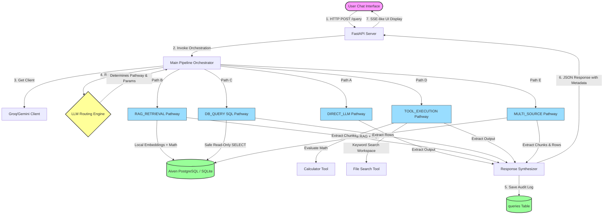
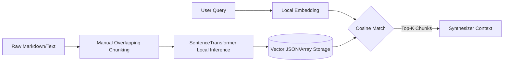
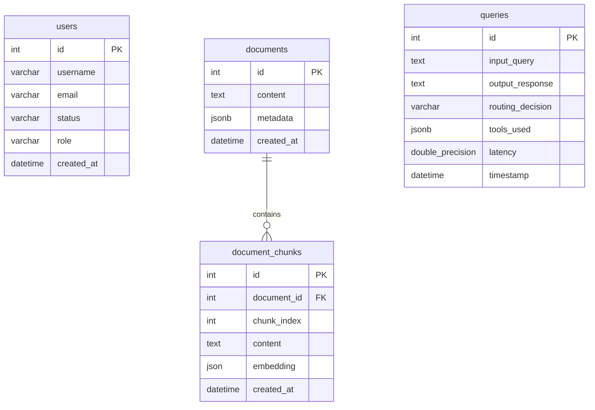

# 🏛️ System Architecture | IT Helpdesk & Knowledge Assistant

Welcome to the definitive architectural design guide for the **IT Helpdesk & Knowledge Assistant**. 

This system represents a state-of-the-art, framework-free AI agent orchestrator built from scratch using FastAPI, SQLAlchemy, PostgreSQL/SQLite, local SentenceTransformers, and Groq/Gemini LLMs. The application classifies, retrieves, computes, and synthesizes solutions for internal IT operations through five discrete pathways.

---

## 🧭 Architectural Core Philosophy
Unlike standard AI agents relying on heavy orchestration frameworks (e.g., LangChain or LlamaIndex), this system is built entirely on **zero-dependency custom control loops**. This ensures:
1. **Ultra-Low Overhead**: No complex framework abstractions adding latency.
2. **Deterministic Control**: Absolute visibility into the prompts, routing rules, tool invocations, and vector math.
3. **High Security**: Custom database level and code-level sanitization routines.
4. **Database Agility**: Dual support for Aiven Cloud PostgreSQL (leveraging raw PL/pgSQL vector math) and SQLite (leveraging in-memory numpy-free Python similarity calculations).

---

## 🗺️ High-Level System Architecture

Below is the comprehensive visual mapping of the system's request-response lifecycle, database integrations, and path execution.



---

## 🛠️ Specialized Processing Pathways

At the heart of the system is the **LLM-Driven Dynamic Router**. It acts as a deterministic dispatcher, classifying any user request into one of five specialized pipelines:

| Pathway Name | Ideal For | Technical Integration | Primary Output |
| :--- | :--- | :--- | :--- |
| **`DIRECT_LLM`** | General IT questions, greetings, concepts (e.g., "What is DNS?"). | Direct API prompt completion using Groq Llama-3.3 / Gemini. | Direct synthesized answer. |
| **`RAG_RETRIEVAL`** | Company-specific IT policies, guides, server/VPN configs. | Local `SentenceTransformer` query embedding matched using Cosine Similarity. | Semantically relevant document chunks. |
| **`DB_QUERY`** | Relational metrics, user statuses, logs (e.g., "Count active users"). | Real-time LLM-generated read-only SQL execution. | Raw tabular data rows from PostgreSQL/SQLite. |
| **`TOOL_EXECUTION`** | Calculator operations, local file scans. | Sandboxed AST parser (calculator) or regex file searcher. | JSON-wrapped tool evaluation outcomes. |
| **`MULTI_SOURCE`** | Complex queries needing logs *and* documentation (e.g., "Who deployed..."). | Simultaneous RAG vector fetch & Read-only SQL query execution. | Integrated chunks & SQL data rows. |

---

## 🧠 Detailed Component Specifications

### 1. Dynamic LLM Router (`agent/router.py`)
The router uses a highly specific system prompt and enforces strict structured output using Pydantic schemas. 

> [!NOTE]
> The routing LLM operates at a **temperature of 0.0** to guarantee strict, deterministic path selections based on instructions and available context.

- **Rate-Limit Fail-Safe**: A custom exponential backoff decorator with randomized jitter ensures that if Groq/Gemini rate-limits are reached, the system retries up to 5 times before failing over gracefully to `DIRECT_LLM`.
- **Database Context Injection**: When generating SQL queries, the system prompt dynamically injects the SQL schema definitions for the `users`, `documents`, and `queries` tables.

### 2. Custom Hybrid Vector Search RAG (`rag/pipeline.py`)
This pathway handles un-structured corporate manuals (SSID setups, email configurations, deployment pipelines, printer installations).



- **Chunking Strategy**: A custom sentence-boundary-preserving text chunker runs with a standard `CHUNK_SIZE` of 500 characters and a `CHUNK_OVERLAP` of 100 characters. It scans backward for delimiters (`\n`, `.`, `?`, `!`, `;`) to keep semantic context unified.
- **Local Dense Embeddings**: Utilizes Hugging Face `all-MiniLM-L6-v2` locally (ideal for machines with $\le$ 4GB VRAM). In production, it operates completely in **offline mode** (`HF_HUB_OFFLINE=1`) to avoid blocking network delays.
- **Cosine Similarity Engine**:
  - **Aiven Cloud PostgreSQL**: Compiles raw PL/pgSQL math equations directly into the database system, bypassing the need for PostgreSQL extensions:
    $$\text{Cosine Similarity} = \frac{\mathbf{A} \cdot \mathbf{B}}{\|\mathbf{A}\| \|\mathbf{B}\|}$$
  - **SQLite Fallback**: Computes pure Python vector comparisons dynamically if the SQLite engine is detected, ensuring zero-configuration local dev environments.

### 3. Read-Only Relational Query Engine (`db/session.py` & `db/models.py`)
The SQLAlchemy integration provides direct, seamless access to structural tables.



> [!WARNING]
> To prevent destructive SQL injections, the router's SQL output undergoes strict code-level verification. The command must start with `SELECT` and is checked against a blacklist (`INSERT`, `UPDATE`, `DELETE`, `DROP`, `ALTER`, `TRUNCATE`, `REPLACE`). Any violation triggers an immediate security fallback.

### 4. Sandboxed Tool Integration (`tools/`)
- **`calculator`**: Instead of standard python `eval()` (which introduces major security concerns), it parses expressions using the python Abstract Syntax Tree (`ast`) and evaluates mathematical nodes safely (supporting additions, subtractions, multiplication, division, powers, and unary operators).
- **`file_search`**: Crawls local repositories and falls back to IT-specific static configuration files (SSIDs, setup configurations, JSON profiles) to extract high-fidelity matches.

---

## 🔒 Security Protocols

We implement security at multiple layers to make the IT Helpdesk suitable for sensitive internal deployment:

```
[User Input]
     │
     ▼
[Router Input Sanitization]  --> Strips dangerous Unicode / Null characters
     │
     ▼
[Safe Read-Only SQL Filter] --> Validates SELECT query strictly; blocks mutative actions
     │
     ▼
[AST Parser sandboxing]    --> Prevents arbitrary code execution in Calculator Tool
     │
     ▼
[Audit Logging Engine]      --> Registers all inputs, outputs, decisions, and latencies
```

---

## 💻 UI Glassmorphic Architecture

The front-end user experience is built using standard, framework-free HTML5, CSS3, and JavaScript, prioritizing premium visual design and rich responsiveness:
- **Glassmorphism Theme**: Uses blur filters (`backdrop-filter: blur(16px)`), harmonized dark/light gradients, dynamic glows, and translucent borders.
- **Metadata Accordion**: Users can toggle open an expandable element below any chat bubble. It shows exactly:
  1. The deterministic **Routing Pathway** selected.
  2. The exact **Latency** in seconds.
  3. The **underlying query** (e.g. the exact SQL statement or raw calculator string).
  4. The **retrieved document snippets** or database records returned.
- **RAG Ingestion Center**: A separate administrative pane allowing managers to upload text/manuals and watch them get chunked, embedded, and indexed in real-time.

---

## ⏱️ Execution & Diagnostics Suite (`test_helpdesk.py`)
The workspace includes a high-fidelity diagnostic suite that tests 10 diverse queries spanning all five routes. It validates routing accuracy, measures individual query latencies, computes running latency averages, and displays real-time execution statistics to maintain system health.
