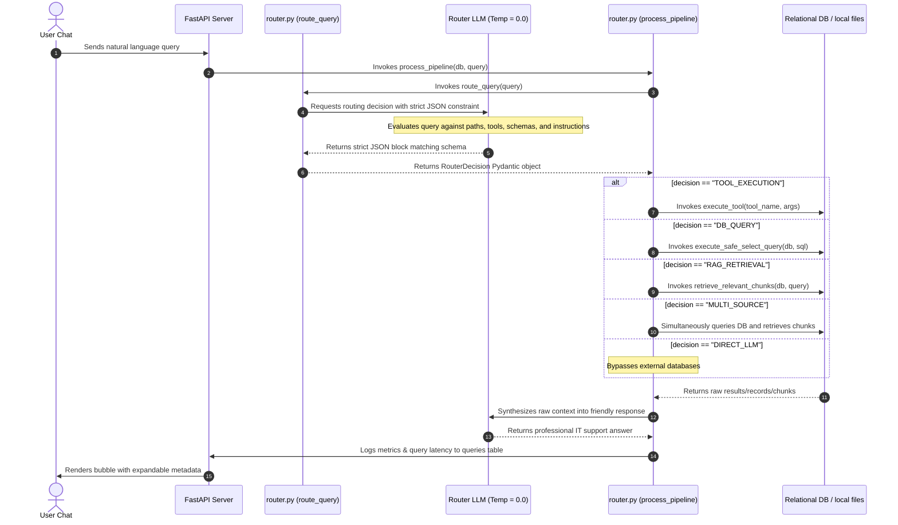

# 🧭 Tool & Pathway Navigation Mechanism

This document details how the **IT Helpdesk & Knowledge Assistant** leverages LLM reasoning to deterministically select pathways, generate query parameters, and execute tools.

---

## 🚀 The Core Routing Architecture

Instead of utilizing heavy-weight, non-transparent agent frameworks, the system employs a **Single-Turn Structured Routing Strategy**. The router serves as the central brain, mapping the incoming natural language query to a deterministic JSON instruction set.

Here is the exact control loop for how a user query translates into a tool or pathway execution:



---

## 🧬 How the Router Decides: Prompt & Parameter Mapping

The system utilizes [route_query](file:///c:/Users/acer/Desktop/InternAIassignment/agent/router.py#L107-L189) in [router.py](file:///c:/Users/acer/Desktop/InternAIassignment/agent/router.py). The LLM is instructed with a comprehensive blueprint of all available tools, database schemas, and retrieval rules:

### 1. Injected Context & Descriptions
The system prompt explicitly presents the LLM with the following:
*   **Path Rules**: Highly descriptive definitions of when a pathway is appropriate (e.g. `RAG_RETRIEVAL` for unstructured setup manuals vs. `DB_QUERY` for structured user lists).
*   **Relational Schema Mapping**: High-fidelity SQL table structural info (`users`, `documents`, `queries` tables along with their columns and data types).
*   **Sandbox Tool Blueprint**: Precise details about the available singletons:
    - **`calculator`**: For mathematical expressions (e.g., converts, percentages, ratios).
    - **`file_search`**: For matching key-phrases or configurations against workspace documents.

### 2. The Structured JSON Schema
The LLM is strictly constrained to output a JSON object that models the Pydantic schema `RouterDecision`:

```python
class RouterDecision(BaseModel):
    decision: str        # exactly: RAG_RETRIEVAL, DB_QUERY, TOOL_EXECUTION, MULTI_SOURCE, DIRECT_LLM
    rationale: str       # explanation for audit logs
    rag_query: str       # (optional) search string optimized for SentenceTransformer
    db_sql_query: str    # (optional) read-only SELECT SQL statement
    tool_name: str       # (optional) 'calculator' or 'file_search'
    tool_args_json: str  # (optional) arguments JSON string, e.g. '{"expression": "500 * 133.4"}'
```

To enforce compliance:
1. **API JSON Mode Configuration**: The LLM API call is executed with `response_format={"type": "json_object"}`.
2. **Temperature Constraints**: Operates at `temperature=0.0`, eliminating creative drift and keeping pathway classification deterministic.
3. **Pydantic Validation**: If the output does not conform to the schema, Pydantic catches it immediately, triggering a graceful fallback to a safe explanation route (`DIRECT_LLM`).

---

## 🛠️ Execution Mapping (`process_pipeline`)

Once [route_query](file:///c:/Users/acer/Desktop/InternAIassignment/agent/router.py#L107-L189) finishes validating the structured `RouterDecision` response, the pipeline orchestrator [process_pipeline](file:///c:/Users/acer/Desktop/InternAIassignment/agent/router.py#L248-L388) takes over to coordinate physical execution:

```python
# Pseudo-code logic from process_pipeline
if routing_decision == "RAG_RETRIEVAL":
    # 1. Runs sentence transformer offline embeddings.
    # 2. Computes Cosine similarity.
    retrieved_docs = retrieve_relevant_chunks(db, decision.rag_query)

elif routing_decision == "DB_QUERY":
    # 1. Strips and validates query for SELECT-only safety.
    # 2. Runs read-only query on PostgreSQL database.
    sql_results = execute_safe_select_query(db, decision.db_sql_query)

elif routing_decision == "TOOL_EXECUTION":
    # 1. Identifies the matching tool inside TOOL_REGISTRY.
    # 2. Safely decodes arguments and calls execute_tool().
    tool_results = execute_tool(decision.tool_name, tool_args)

elif routing_decision == "MULTI_SOURCE":
    # Executes both paths concurrently and returns unified arrays.
    ...
```

---

## 🔒 Security Safeguards

To prevent prompt injection or server compromise during tool navigation:
1. **SQL Sanitization Check**: The SQL execution routine [execute_safe_select_query](file:///c:/Users/acer/Desktop/InternAIassignment/agent/router.py#L190-L208) blocks any commands containing dangerous mutative keywords such as `INSERT`, `UPDATE`, `DELETE`, `DROP`, `ALTER`, `TRUNCATE`, or `REPLACE`.
2. **Calculator Sandbox**: The `calculator` tool parses the formula strictly into an **Abstract Syntax Tree (AST)** and evaluates it node-by-node using safe arithmetic operators, completely bypassing dangerous python `eval()` or `exec()` loops.
